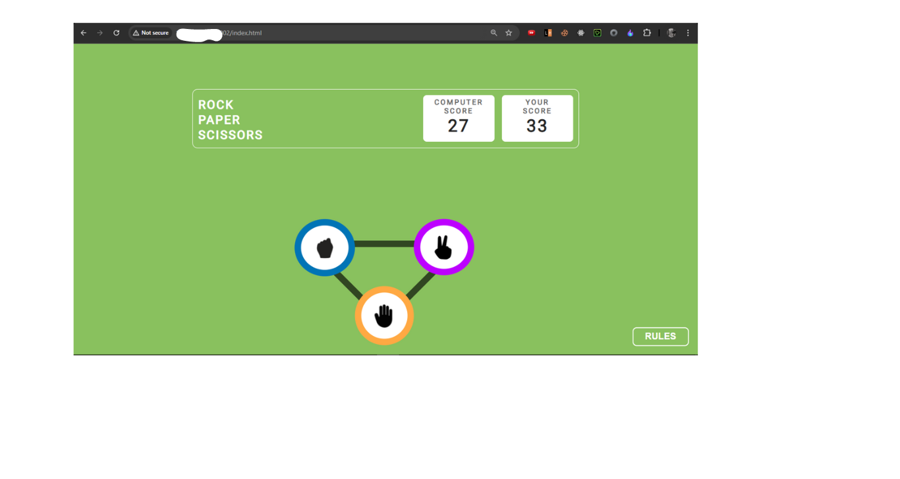
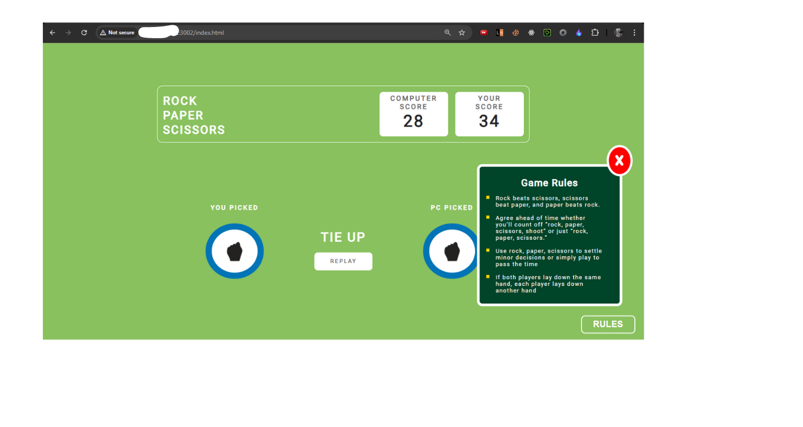
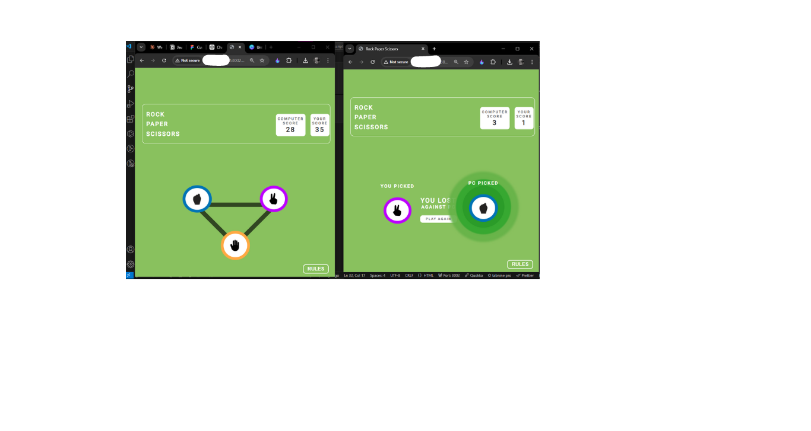
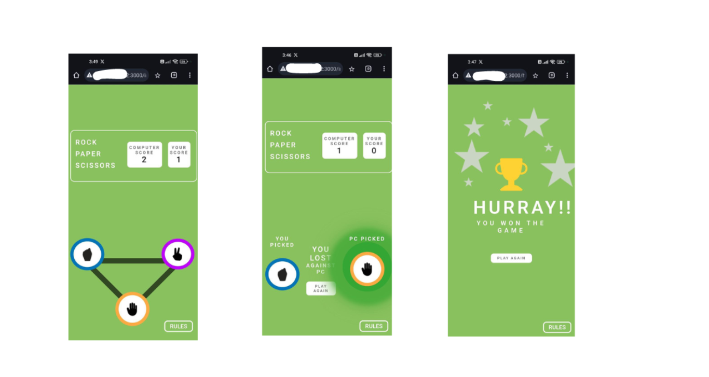

# Rock Paper Scissors Game

## Overview

This project is a Rock Paper Scissors game created using HTML, CSS, and JavaScript. The game interface includes a triangular layout for selecting rock, paper, or scissors, a scoreboard to track the score, and a dynamic result display. It features responsive design for both desktop and mobile devices.

# Features

- Local Storage for Scores: The scores are stored locally, so even if the page is refreshed, the scores will persist.
- Simultaneous Play Across Tabs: Multiple players can play the game simultaneously in different tabs or windows of the - browser, each maintaining their own scores independently.
- Responsive Layout: The game is optimized for both desktop and mobile views.
- Triangle Layout: The rock, paper, and scissors choices are arranged in a triangular layout.
- Scoreboard: Displays the current score of the player and computer.
- Result Display: Shows the result of each round (win, lose, or draw).
- Animations: Highlighted glow animation around the selected option.
## Screenshots

### Desktop View:

### Mobile View:

# How to Play

- Select an option: Click on rock, paper, or scissors.
- Computer randomly picks: The computer randomly selects one of the three options.
- Result displayed: The result of the match (win, lose, or draw) is shown along with a glowing highlight around the selected image.
- Score updates: The scoreboard updates based on the outcome. Scores are stored in the browser's local storage, so they persist even after a page reload.